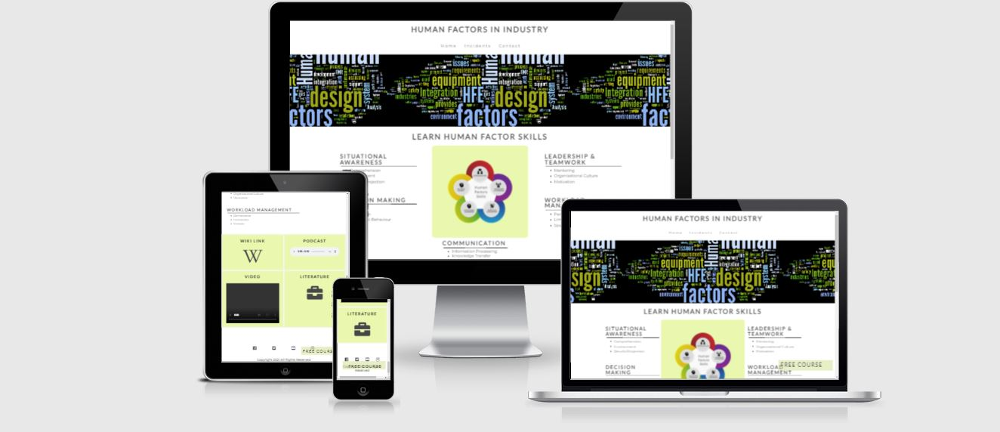

<H2>Human factors project milestone 1</H2>

<a href="https://sdmoen.github.io/humanfactors-project/">Link to website</a>

(device response image)

<H2>User Experience (UX)</H2>

User stories

Visitor Goals
<ul>
<li>Developer Goals</li>
<li></li>
<li></li>
<li></li>
</ul>

#

####
<ul>
<li></li>
<li></li>
<li></li>
<li></li>
</ul>

<h2>Design</h2>

#

####
<ul>
<li></li>
<li></li>
<li></li>
<li></li>
</ul>

<h2></h2>

#

####
<ul>
<li></li>
<li></li>
<li></li>
<li></li>
</ul>

<h2>Features</h2>

#

####
<ul>
<li></li>
<li></li>
<li></li>
<li></li>
</ul>

<h2>Languages Used</h2>

#

####
<ul>
<li></li>
<li></li>
<li></li>
<li></li>
</ul>

<h2>Technologies Used</h2>

#

####
<ul>
<li></li>
<li></li>
<li></li>
<li></li>
</ul>

<h2>Testing</h2>

#

####
<ul>
<li></li>
<li></li>
<li></li>
<li></li>
</ul>

<h2>Issues Encountered</h2>

Known Bugs

####
<ul>
<li></li>
<li></li>
<li></li>
<li></li>
</ul>

<h2>Deployment</h2>

#

####
<ul>
<li></li>
<li></li>
<li></li>
<li></li>
</ul>

<h2>Further Learnings</h2>

#

####
<ul>
<li></li>
<li></li>
<li></li>
<li></li>
</ul>

<h2>Credits</h2>

#

####
<ul>
<li></li>
<li></li>
<li></li>
<li></li>
</ul>

`python3 -m http.server`